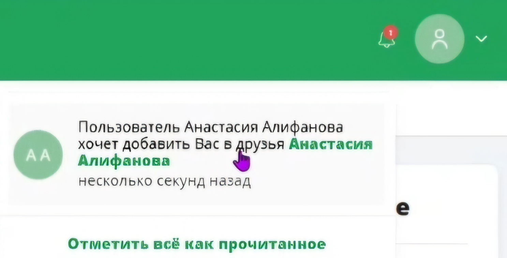
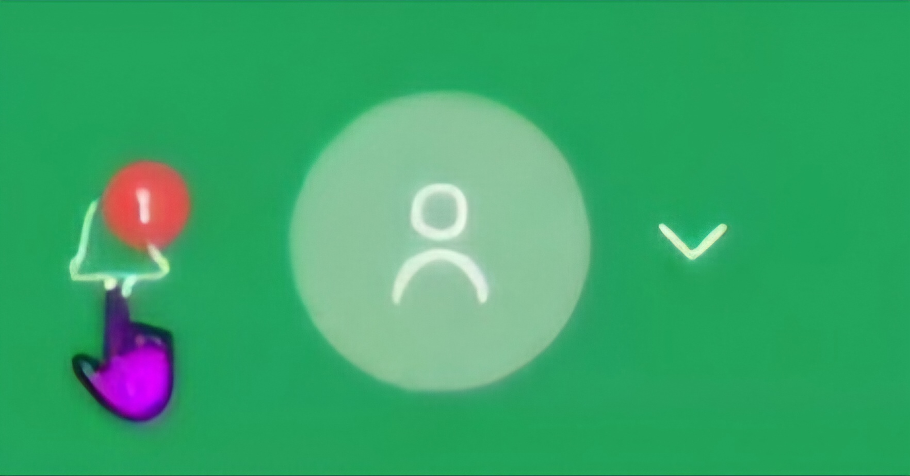
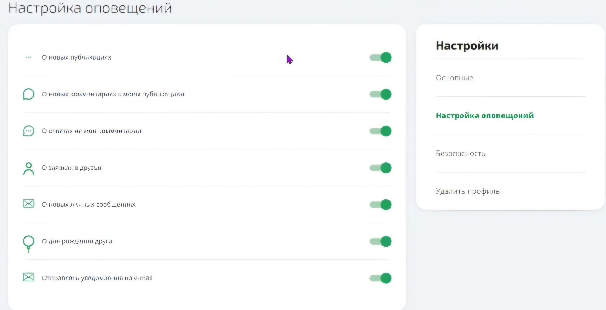

# NotificationService

## Описание проекта
Данный проект представляет собой микросервис уведомлений для социальной сети, реализованный в виде Spring-приложения. Основные функциональные возможности:
 - Получить уведомления пользователя:  GET http://localhost:8084/api/v1/notifications
   
 - Добавить уведомление:   POST http://localhost:8084/api/v1/notifications

JSON:

  {

   "authorId": "1234-1241-a125-726c-246b",

   "userId": 1,

   "notificationType": "MESSAGE",

   "content": "Новое сообщение от пользователя!"

   }
   
 - Получить количество непрочитанных уведомлений:  GET http://localhost:8084/api/v1/notifications/count
   
 - Пометить уведомления прочитанными:  PUT http://localhost:8084/api/v1/notifications/readed
 - Создать настройки уведомлений:  POST http://localhost:8084/api/v1/notifications/settings
   

JSON:

   {

   "id": "1234-5678-9012-3456-7890",

   "userId": "1234-1241-a125-726c-246b",

   "friendRequest": false,

   "friendBirthday": false,

   "postComment": false,

   "commentComment": false,

   "post": false,

   "message": false,

   "likeMessage": false,

   "sendPhoneMessage": false,

   "sendEmailMessage": false

}
 - Получить настройки уведомлений:  GET http://localhost:8084/api/v1/notifications/settings
   
 - Изменить настройки уведомлений:  PUT http://localhost:8084/api/v1/notifications/settings

JSON:

{

"enable": true,

"notificationType": "MESSAGE"

}

## Стек используемых технологий

* Java 21
* Spring Boot
* Spring Security
* PostgreSQL
* Kafka
* TestContainers, JUnit
* Teamcity, Docker

## Инструкция по локальному запуску

1. Установите и настройте PostgreSQL сервер на своем компьютере.
2. Создайте базу данных для проекта notifications_db с таблицами notifications и notification_settings.
3. Склонируйте репозиторий проекта:

git clone https://github.com/NancyD2017/NotificationService.git

4. Перейдите в директорию проекта:

cd mc-notification-master

5. Откройте проект в вашей IDE (например, IntelliJ IDEA или Eclipse).
6. Настройте подключение к базе данных PostgreSQL в файле application.yml, а также добавьте вашу почту для отправления email-уведомлений:

datasource:

    url: jdbc:postgresql://${HOST:localhost}/notifications_db

    username: ${POSTGRES_USER:postgres}

    password: ${POSTGRES_PASSWORD:postgres}

mail:

    host: smtp.yandex.ru
    
    port: 465
    
    username: <Введите свою почту>
    
    password: <Введите свой пароль>
    
    protocol: smtps

7. Соберите и запустите проект с помощью Gradle:

.\gradlew bootRun

8. Откройте веб-интерфейс в браузере по адресу http://localhost:8084/api/v1/....
