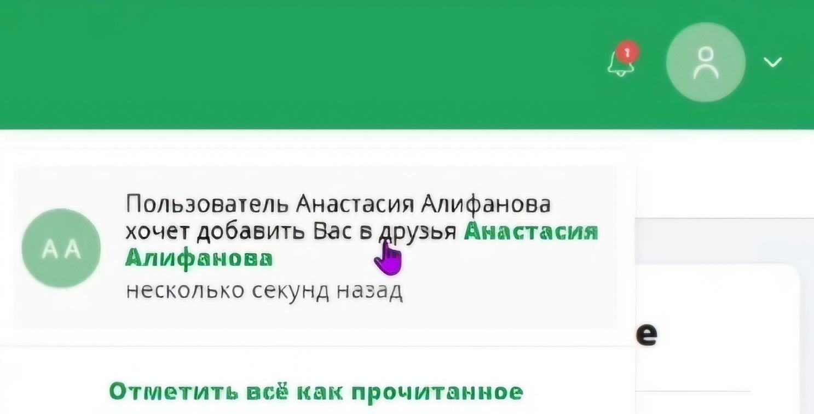
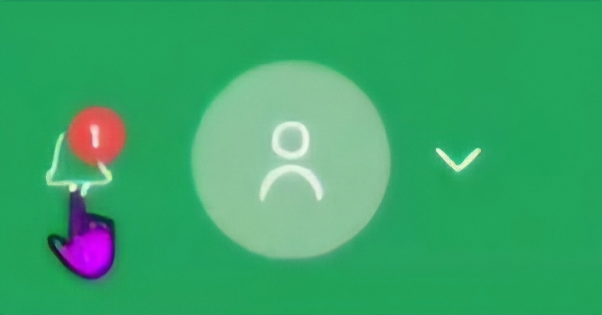
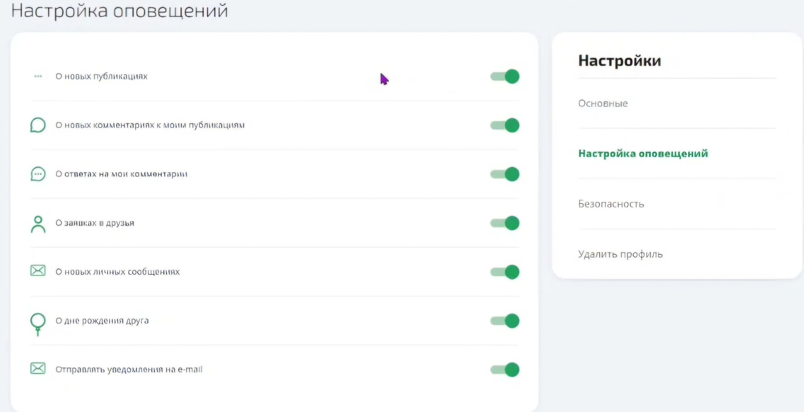

# Notification Service — Social Network Microservice

A production-grade notification microservice built as part of a **team social network project**. Handles real-time user notifications via REST API and Apache Kafka event streaming.

>  **Team project** — developed collaboratively as part of a multi-service social network platform

---

## Screenshots

<!-- Screenshot: Main dashboard showing the notification feed (GET /api/v1/notifications) -->


<!-- Screenshot: Unread notification counter badge in the UI header -->


<!-- Screenshot: Notification settings panel with toggles for each notification type -->


---

## Features

- **Get user notifications** — `GET /api/v1/notifications`
- **Create a notification** — `POST /api/v1/notifications`
- **Unread count** — `GET /api/v1/notifications/count`
- **Mark as read** — `PUT /api/v1/notifications/readed`
- **Notification settings (CRUD)** — `POST/GET/PUT /api/v1/notifications/settings`

Notification types supported: `MESSAGE`, `FRIEND_REQUEST`, `FRIEND_BIRTHDAY`, `POST`, `POST_COMMENT`, `COMMENT_COMMENT`, `LIKE_MESSAGE`, and more.

---

## Tech Stack

| Category | Technology |
|---|---|
| Language | Java 21 |
| Framework | Spring Boot, Spring Security |
| Messaging | Apache Kafka |
| Database | PostgreSQL |
| Testing | JUnit 5, TestContainers |
| CI/CD | TeamCity, Docker |

---

## Getting Started

### Prerequisites
- Docker & Docker Compose
- Java 21+

### Local Setup

1. **Clone the repository**
   ```bash
   git clone https://github.com/NancyD2017/mc-notification-master.git
   cd mc-notification-master
   ```

2. **Configure the database** — update `application.yml`:
   ```yaml
   datasource:
     url: jdbc:postgresql://${HOST:localhost}/notifications_db
     username: ${POSTGRES_USER:postgres}
     password: ${POSTGRES_PASSWORD:postgres}
   mail:
     host: smtp.yandex.ru
     port: 465
     username: <your-email>
     password: <your-password>
   ```

3. **Build and run**
   ```bash
   ./gradlew bootRun
   ```

4. API available at: `http://localhost:8084/api/v1/`

---

## 📬 API Reference

### Create Notification
```http
POST /api/v1/notifications
Content-Type: application/json

{
  "authorId": "1234-1241-a125-726c-246b",
  "userId": 1,
  "notificationType": "MESSAGE",
  "content": "New message from user!"
}
```

### Update Notification Settings
```http
PUT /api/v1/notifications/settings
Content-Type: application/json

{
  "enable": true,
  "notificationType": "MESSAGE"
}
```

---

## Architecture

<!-- Architecture diagram: Show the microservice's position within the social network system.
     Include: API Gateway → NotificationService → PostgreSQL (storage) and Kafka (event bus connecting to other services like UserService, PostService) -->
> *Architecture diagram coming soon*

---

## License

This project is part of a private team social network platform developed for educational purposes.
